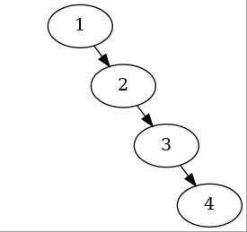
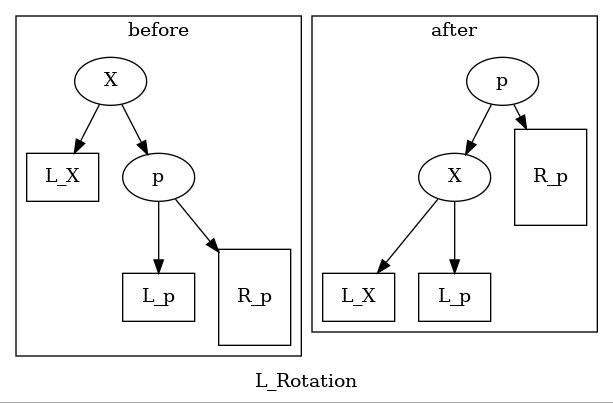
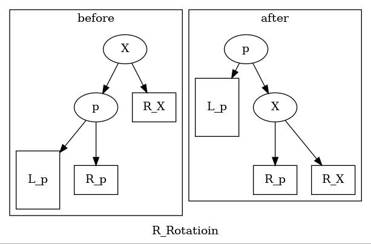
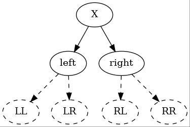
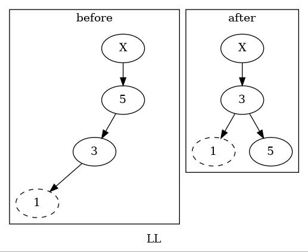
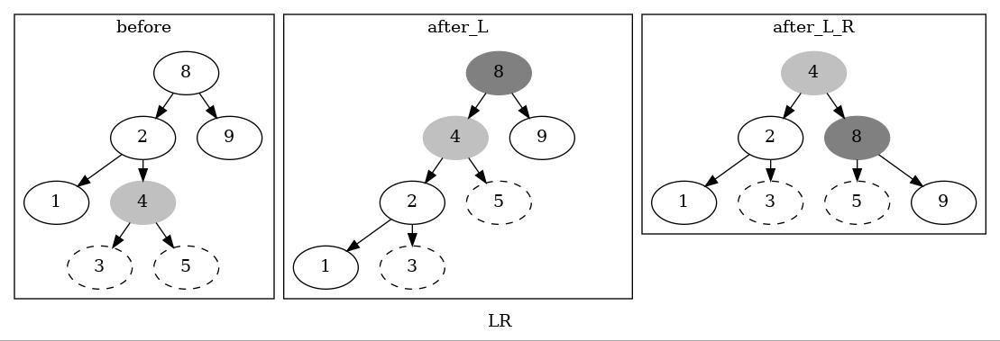

# 树进阶

在Tree章节中我们提到树的基本思想是作为一种操作平均时间复杂度为O(logN)的数据结构。在《数据结构与算法分析》p107中，分析了一棵由长度为N的随机插入序列得来的BST，它的深度的期望值为O(logN)。  
然而如果一颗BST的插入序列恰好为有序序列，它就会退化为单链表，此时操作的时间复杂度退化为O(N)

为了避免出现这种情况，我们引入平衡二叉树的概念，即没有任何一个结点的深度过深。

一种思想是用平衡条件约束二叉树，使其每一个结点的操作时间都为O(logN)，其经典代表是AVL树。另一种比较新的思想是，放宽约束，虽然不保证单一操作的时间，但对于M次操作，保证其时间为O(MlogN)，例如splay树

## AVL Tree

AVL树是最早发明的自平衡二叉树，其名字来源于其发明者G. M. Adelson-Velsky和E. M. Landis。AVL树仍是一棵二叉搜索树

### 平衡因子

某结点的平衡因子定义为，其左子树的深度 - 右子树的深度

AVL树中，所有结点的平衡因子因子的绝对值不大于1

### 旋转

AVL树通过一种称为旋转的操作来使失衡的子树重新平衡，分别为左旋和右旋，为了方便起见，记为L旋转和R旋转

### 失衡的恢复
根据新插入的（导致失衡的）结点所在的结点，可以分为以下4种情况

1. 插入在左子树的左子树,LL
2. 插入在左子树的右子树,LR
3. 插入在右子树的左子树,RL
4. 插入在右子树的右子树,RR

四种情况所对应的调整方式为

|失衡|调整|
|--|--|
|LL|R旋转|
|RR|L旋转|
|LR|L-R旋转|
|RL|R-L旋转|

其中L-R旋转表示先L旋转再R旋转，R-L旋转同理

注意单旋转和失衡情况相反，而双旋转和失衡情况相同

### 举例

### LL

如图，插入结点1后，该树在LL插入后失衡，进行一次右旋重新平衡，其中X表示5的父结点，可以为任意树或空树

### LR

如图，插入结点3后，对于8来说，在LR插入后失衡，进行L-R旋转调整。将3的父结点4左旋，再将祖父结点8右旋，得到平衡后的AVL树。

注意插入结点在左右子树的区别，即插入3和5时的区别

### summary

AVL树通过对平衡因子的约束，保证每次对结点的操作拥有O(logN)的时间复杂度。然而其缺点是，一要借助额外的空间储存平衡因子，二是插入引起的旋转有时候代价很高

## Splay Tree

伸展树利用了程序的局部性，将最近访问的结点移动到根结点，同时对路径上的结点进行调整。这一点有点像并查集的路径压缩

伸展树的调整方式仍然用到了旋转