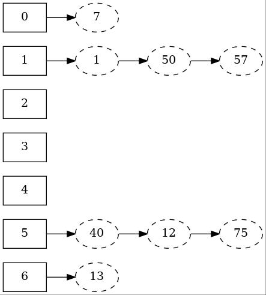
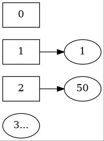
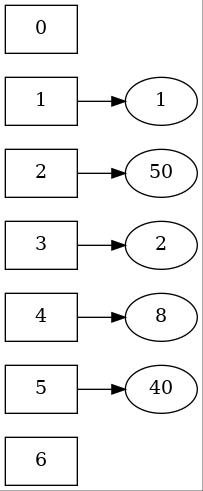

# 4-散列
{: .no_toc}
1. TOC  
{:toc}

上一节我们提到，为了达到访问效率为O(logn)，我们引入了二叉树。二叉树的最差访问效率为O(n)，平均访问效率为O(logn)。这一节我们更近一步，介绍一种经典的以空间换时间的数据结构——散列，或者哈希表(hash table)，它的平均访问效率为O(1)

## 散列

散列通常用在字符串中，比如"Hello world"通过SHA-1得到的哈希值为`7B502C3A1F48C8609AE212CDFB639DEE39673F5E`

为了简单起见，我们暂时把散列用在比较小的数字上，体会一下散列的核心思想

## 散列表的相关概念

例如，我们选取散列函数为`lambda x: x%7`（即f(x)=x mod 7），选取表长11，依次插入1，13，50，40，可以得到下图所示结构


1. 关键字(key)：待插入的元素的原始数据，如本例中的1，40，50
2. 散列函数/哈希函数(hash function)：将关键字映射为地址的函数，形如Addr=H(key)，其中H为散列函数。如本例中为f(x)=x mod 7。散列函数的好坏对于散列的性能有着至关重要的影响。
3. 哈希值(hash value)：散列函数映射出的地址也叫哈希值。散列实际上操作的是键值对<key,value>
4. 散列表长(table size)：散列表最多能容纳的关键字个数，很多情况下散列表长就等于散列函数可能的结果数（如本例中为7），但也可以不同
5. 碰撞(collision)：当遇到两个哈希值相同的关键字时，我们称发生了一次碰撞。如本例中，1和50的哈希值都是1，他们就发生了碰撞。因为碰撞的存在，散列表的结果和插入顺序是息息相关的。下文将会介绍两种碰撞处理的方法，本例中用的是开放寻址法
6. 负载因子(load factor)：(假设表长和散列函数结果数相同)负载因子=表中已有的元素个数/表长。当表中已有元素个数很多时，发生碰撞的概率会大大增加。因此在实际应用中我们可以通过负载因子来提前调整散列表(如再散列Rehashing)
7. 平均查找长度(Average Search Length, ASL)：衡量散列表性能的一个指标。每对一个散列表中的存储单元进行查看，查找长度就增加1。平均查找长度的具体定义视具体情况而定。一个常见的定义是，对于表长为n的散列表，查找失败时的 $ASL={1 \over n} \sum^n_{i=0} SL_{fail}$

## 碰撞处理

我们介绍两种简单的碰撞处理方法，拉链法和开放寻址法

### Seperate Chaining

分离链接法，或者拉链法指，当有哈希值一样的关键字时，将它们存储到一个链表中，如图



### Open Addressing

我们用下述结构的散列表进行讨论。和前一节一样，你可以忽略Function并将其视为一个全局函数

```cpp
using Index = int;
using Key = int;
using Function = std::function<Index(Key)>;

struct HashTable {
    int table_size;
    std::vector<Key> cells;
    Function hash_fn;

    void initialize(); //初始化
    bool isIndexEmpty(Key key); //返回当前index是否存在有效值
}
```

#### 线性探测

线性探测法在遇到冲突时，依次向后寻找地址，直到发现空位或者表满

```cpp
std::optional<Index> insert(Key key, HashTable *HT) {
    //获取哈希值
    Index idx = hash_fn(key);
    //线性探测
    int size = HT->table_size;
    for (int i=0;i < size;++i) {
        Index cur_idx = (idx + i) % size;
        if (HT->isIndexEmpty(cur_idx)) {
            HT->cells.at(cur_idx) = key;
            return cur_idx;
        }
    }
    return {};
}
```

{: .note}
> std::optional是C++17引入的新特性。你也可以不使用optional，而是靠返回-1之类的特殊值进行判断。optional就是为了这种可能失败的返回值而设计的，同时强制通过obj.has_value()和obj.value()检查以避免遗忘特殊值检查

比如前面的例子，哈希值为1的位置已经有元素1存在了，元素50不能在放在哈希值为1的位置了，因此向后探测，然后放在哈希值为2的位置



线性探测的步长可变，但如果要遍历全表，必须满足gcd(step,table_size)=1，其中gcd表示最大公约数。可见step为1时是满足该等式的一个平凡条件


#### 元素的删除

由于哈希碰撞的存在，我们不能直接删除一个元素。比如之前的例子，元素50由于元素1的存在，被迫放在了哈希值2的位置，如果我们直接删除元素1，那么再次寻找元素50的时候就会发现在哈希值1的位置没有元素了，程序会误认为散列表中没有元素50。为了避免这个问题，我们需要采用一种延迟删除(lazy deletion)方法，即在删除元素时并不直接从散列表中移除，而是标记一个脏位dirty，在下次插入时覆盖

#### 哈希聚集(clustering)

ps: 本段中，哈希值的平均查找长度(ASL)指，对于一个含有k个关键字的**哈希值**，其每一个关键字成功访问和查找失败的长度平均值，即 ${1 \over k+1} (SL_{fail}+\sum^k_{i=0} SL_{success})$

当我们采用线性探测时，比如[前例](#散列表的相关概念)中插入1和50后，哈希值为2的位置也被占据了，这时如果要插入哈希值为2的元素，就要后移插入哈希值为3的位置

> 观察此时哈希值5的位置，假设此时要插入新元素5，它只会影响自身的ASL

如果再插入一个哈希值为1的元素(例如8)，就要把哈希值为4的位置占了。注意这个时候如果要插入新元素5，它**不但会影响自身的ASL，还会同时增加哈希值为1,2,3,4的ASL**！



这种像滚雪球一般严重影响哈希表ASL的现象称为初次聚集(primary clustering)。可以通过平方探测避免初次聚集

#### 平方探测

线性探测在发生碰撞后，对于该哈希值，依次访问index加上{0,1,2,3,4,...}。而平方探测则是依次访问{0,1,-1,4,-4,...}， 即{$0,\pm 1,\pm 2,...$}

可以证明，当表长为素数并且表至少半空时，平方探测总能成功插入。此时需要密切关注负载因子。此外，如果表长为素数并且满足形式为n=4k+3，那么平方探测可以访问整个散列表

不过平方探测也存在问题，由于线性探测和平方探测的寻址都与关键字值无关，对于相同哈希值的不同关键字，都需要探测相同的序列。例如对于哈希表长为11哈希值为6的关键字来说，都要探测{6,7,5,10,2...}。这种情况被称为二次聚集(secondary clustering)。下文要介绍的双散列法虽然cache性能较低，但可以避免初次聚集和二次聚集

#### 双散列法

## 再散列Rehashing

当散列表中已有元素个数很多时，发生碰撞的概率会大大增加。为了减轻后续可能发生的碰撞，我们可以通过增大表长，将已有元素重新散列一次的方法来减小载荷因子。

但是再散列需要花费O(n)的时间，对于实时性要求很高的场景（如医疗航天等），再散列的过程中可能会发生不可挽回的情况。这种情况下更推荐用拉链法